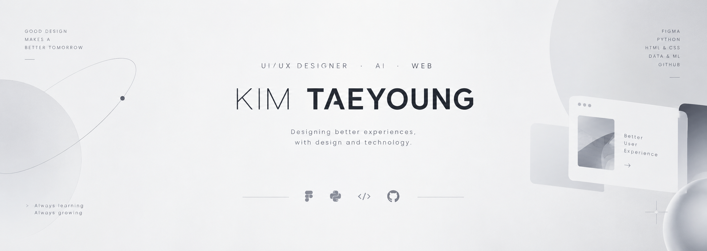

<div align="center">
<p align="center">
  
</p>
# KIM TAEYOUNG

### UI/UX Designer · AI & Web Learner

사용자의 경험을 고민하고,  
디자인과 기술을 함께 배우며 직접 만들어가고 있습니다.

<br>

[](https://github.com/vlvo200364957)
[](https://www.python.org/)
[](https://www.figma.com/)
[](https://developer.mozilla.org/en-US/docs/Web/HTML)
[](https://developer.mozilla.org/en-US/docs/Web/CSS)

</div>

---

## ABOUT

묵묵히 고민하고 끝까지 책임지는 디자이너입니다.

UI/UX 디자인을 공부하며 사용자가 편하게 사용할 수 있는 화면과  
서비스의 흐름을 고민하고 있습니다.

최근에는 Python, 데이터 분석, 머신러닝과 AI를 공부하며  
디자인에 기술을 더하는 방법을 배우고 있습니다.

---

## WHAT I DO

| AREA | FOCUS |
| --- | --- |
| 🎨 UI/UX | 사용자 경험, 화면 구성, UI 디자인 |
| 🌐 WEB | HTML / CSS 기반 웹 구현 |
| 🤖 AI | AI를 활용한 디자인 및 개발 |
| 🐍 PYTHON | Python 기초 및 데이터 처리 |
| 📊 DATA | Pandas 기반 데이터 분석 |
| 🧠 ML | Machine Learning 기초 학습 |

---

## TOOLS

**Design**

`Figma` `Photoshop` `Illustrator`

**Web**

`HTML` `CSS`

**Data & AI**

`Python` `Pandas` `Scikit-learn`

**Version Control**

`Git` `GitHub`

---

## STUDY & PROJECTS

### `lec_python`

Python 기초 문법부터 Pandas를 활용한 데이터 처리까지 공부하고 있습니다.

### `lec_ml`

Scikit-learn을 활용하여 머신러닝의 기본 개념과  
데이터를 활용한 모델 학습 과정을 공부하고 있습니다.

### `UI/UX PROJECTS`

사용자의 목적과 경험을 중심으로 웹페이지와 서비스를 디자인하고 있습니다.

---

## CURRENTLY LEARNING

```text
UI/UX Design
      ↓
HTML · CSS
      ↓
Python · Pandas
      ↓
Machine Learning
      ↓
AI × Design
